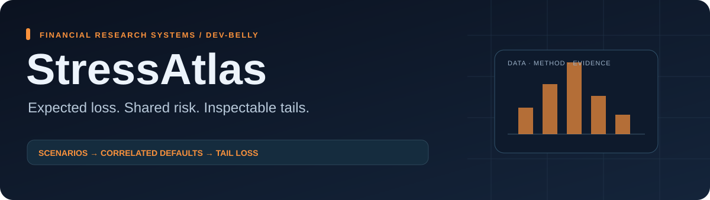
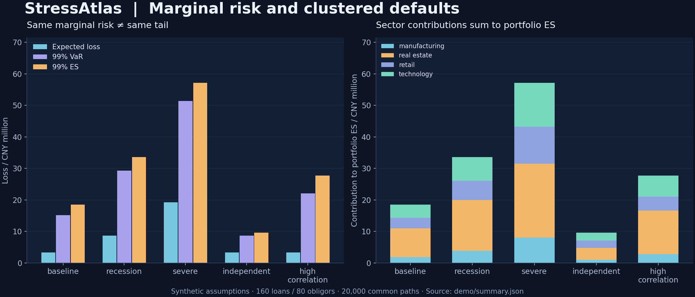

# StressAtlas

**Credit portfolio stress tests that distinguish marginal risk from clustered defaults.**

[](https://github.com/dev-belly/StressAtlas/actions/workflows/ci.yml)
[Open the online report](https://dev-belly.github.io/StressAtlas/) · [中文说明](README.zh-CN.md) · [Model and tail math](docs/METHODOLOGY.md) · [Data contract](docs/DATA_CONTRACT.md) · [Case study](docs/CASE_STUDY.md) · [Interview notes](docs/INTERVIEW.md)

Scenario assumptions are explicit. All scenarios reuse the same global, sector and obligor-level random drivers. Multiple loans to one borrower share one default event. The resulting report includes analytic expected loss, simulated mean and sampling error, discrete VaR/ES, paired scenario differences and additive sector attribution.



## Run in one minute

```bash
git clone https://github.com/dev-belly/StressAtlas.git
cd StressAtlas
python -m pip install -r requirements-replay.txt
python -m pip install -e .
stressatlas demo --out outputs
stressatlas verify --out outputs
python -m unittest discover -s tests -v
```

Open `outputs/report.html` in a browser. It works offline and lets you switch between loss histograms and sector contributions. Python 3.11+; NumPy and SciPy. Locked numerical versions are supplied for saved-artifact replay.

```bash
stressatlas demo --paths 100000 --seed 42 --out outputs-large
stressatlas run --inputs demo/inputs.json --out outputs
```

## Computed synthetic example

**160 loans · 80 obligors · 4 sectors · CNY 169.6m base EAD · 20,000 shared paths.** All PD/LGD/EAD inputs are synthetic assumptions, not calibrated borrower estimates.

| Scenario | Analytic EL / CNY m | 99% VaR / CNY m | 99% ES / CNY m |
| :--- | ---: | ---: | ---: |
| Baseline | 3.366 | 15.140 | 18.476 |
| Recession | 8.692 | 29.289 | 33.602 |
| Severe | 19.270 | 51.326 | 57.176 |
| Independent defaults | 3.366 | 8.718 | 9.621 |
| Higher asset correlation | 3.366 | 22.085 | 27.706 |

The last two scenarios keep marginal PD, LGD and EAD fixed. Analytic expected loss is unchanged; this simulated portfolio's tail changes substantially. Correlation changes are not guaranteed to increase every individual path or every portfolio quantile.

Source: [saved scenario table](demo/scenarios.csv), [sector attribution](demo/sector_es.csv), [normalized inputs](demo/inputs.json), [summary and driver fingerprint](demo/summary.json).

## Details that matter

- **Borrower identity:** splitting a loan does not create independent default events.
- **Common random numbers:** compare scenario losses path by path; report the standard error of paired differences.
- **Discrete tails:** ES integrates exactly the worst `N × (1−α)` path-equivalents, including fractional boundary mass. Averaging every loss `>= VaR` can be wrong when losses are tied.
- **Attribution:** sectors share the portfolio-tail weights; boundary ties share weight equally. Contributions sum to portfolio ES and do not depend on tie order.
- **Numerical checks:** exact PD=0/1, analytic EL agreement, scenario monotonicity under fixed correlation, seed/order/chunk invariance and rehashed-report corruption regressions.

## Artifacts and limits

`inputs.json` and the saved seed regenerate all paths. `loss_sample.csv` contains only the first 200 paths; it is **not the full tail sample**. The manifest checks six artifacts; verification also reruns the model. Its hashes do not authenticate external source data.

The model has one-period Gaussian factors with deterministic scenario LGD/EAD. It does not model rating migration, contagion networks, dynamic recovery, cash flows or macro calibration. It is not an implementation of Basel regulatory capital. Mean Monte Carlo SE is not a VaR/ES confidence interval.

The random driver bank is held in memory (`O(paths × obligors)`); chunking bounds the latent-loss intermediates, not the whole simulation's memory. There is no claim of production-scale throughput. MIT license.
